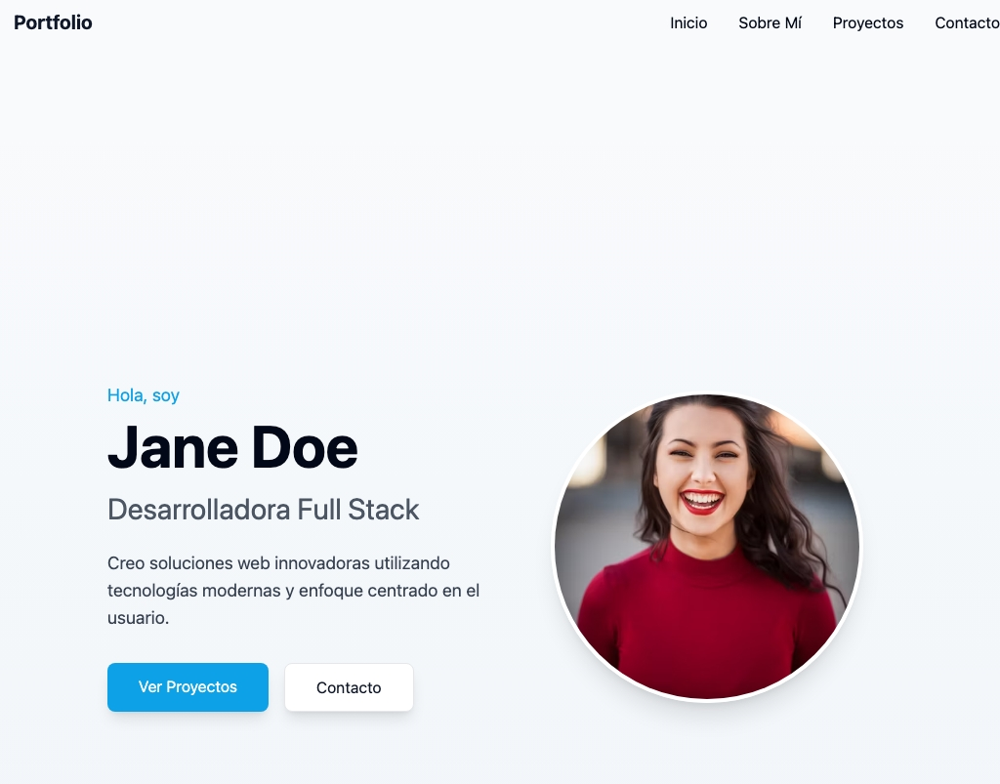

# Portafolio Web Profesional

Un portafolio profesional de una sola página (One Page) orientado al sector tecnológico, construido con React y diseñado para mostrar tu experiencia, proyectos y datos de contacto de forma elegante y dinámica.

## Descripción

Este proyecto es un portafolio web personal responsivo que carga dinámicamente toda la información desde archivos JSON. Está diseñado para desarrolladores y profesionales del sector tecnológico que desean mostrar su trabajo de forma profesional y personalizable sin necesidad de modificar código fuente.



## Características Principales

- **Diseño Responsivo**: Se adapta a cualquier dispositivo (móvil, tablet, escritorio)
- **Carga Dinámica**: Toda la información se carga desde archivos JSON fácilmente editables
- **Secciones Completas**: Inicio, Sobre Mí, Proyectos y Contacto
- **Personalizable**: Fácil de adaptar a tus necesidades cambiando solo los archivos JSON
- **Moderno**: Construido con React y Tailwind CSS para un diseño limpio y actual

## Tecnologías Utilizadas 🛠️

- [React](https://reactjs.org/) - Biblioteca JavaScript para construir interfaces de usuario
- [Vite](https://vitejs.dev/) - Herramienta de desarrollo rápida para React
- [Tailwind CSS](https://tailwindcss.com/) - Framework CSS de utilidad para el diseño
- [shadcn/ui](https://ui.shadcn.com/) - Componentes de UI reutilizables y accesibles

## Comenzando 🚀

Estas instrucciones te permitirán obtener una copia del proyecto funcionando en tu entorno local para propósitos de desarrollo y pruebas.

### Prerrequisitos 📋

Para ejecutar este proyecto necesitas tener instalado:

- [Node.js](https://nodejs.org/) (v14.0.0 o superior)
- [npm](https://www.npmjs.com/) (v6.0.0 o superior)

### Instalación 🔧

1. Clona el repositorio:

```bash
git clone git clone https://github.com/adalid-cl/portafolio-web-react.git
cd portafolio-web-react
```

2. Instala las dependencias:

```bash
npm install
```

3. Inicia el servidor de desarrollo:

```bash
npm run dev
```

4. Abre tu navegador en `http://localhost:8080`

## Estructura del Proyecto 📁

```
src/
├── components/       # Componentes reutilizables
│   ├── Navbar.jsx    # Barra de navegación
│   ├── Hero.jsx      # Sección principal (inicio)
│   ├── About.jsx     # Sección Sobre Mí
│   ├── Projects.jsx  # Sección de Proyectos
│   ├── Contact.jsx   # Sección de Contacto
│   └── Footer.jsx    # Pie de página
├── data/             # Archivos JSON con la información del portafolio
│   ├── personal.json # Información personal (nombre, bio, etc.)
│   ├── projects.json # Lista de proyectos
│   └── contact.json  # Información de contacto y redes sociales
└── pages/            # Páginas de la aplicación
    └── Index.tsx     # Página principal que muestra todas las secciones
```

## Personalización 🎨

El portafolio está diseñado para ser fácilmente personalizable modificando los archivos JSON en la carpeta `src/data/`.

### Modificar Información Personal

Edita el archivo `src/data/personal.json`:

```json
{
  "name": "Tu Nombre",
  "profession": "Tu Profesión",
  "shortBio": "Una breve descripción sobre ti",
  "fullBio": "Una descripción más detallada de tu experiencia y habilidades...",
  "avatarUrl": "URL de tu foto de perfil"
}
```

### Modificar Proyectos

Edita el archivo `src/data/projects.json`:

```json
[
  {
    "id": 1,
    "name": "Nombre del Proyecto",
    "description": "Descripción del proyecto",
    "image": "URL de la imagen del proyecto",
    "tags": ["React", "Node.js", "MongoDB"],
    "githubUrl": "URL del repositorio en GitHub",
    "liveUrl": "URL del proyecto en vivo"
  }
  // Añade más proyectos aquí
]
```

### Modificar Información de Contacto

Edita el archivo `src/data/contact.json`:

```json
{
  "email": "tu.email@ejemplo.com",
  "socialMedia": [
    {
      "name": "LinkedIn",
      "url": "https://linkedin.com/in/tuusuario",
      "icon": "linkedin"
    }
    // Añade más redes sociales aquí
  ]
}
```

## Despliegue 📦

Para crear una versión de producción y desplegarla:

1. Construye el proyecto:

```bash
npm run build
```

2. Los archivos generados estarán en la carpeta `dist/`, que puedes subir a cualquier servicio de hosting estático como:
   - [Netlify](https://www.netlify.com/)
   - [Vercel](https://vercel.com/)
   - [GitHub Pages](https://pages.github.com/)
   - [Surge](https://surge.sh/)

## Personalizaciones Adicionales

### Cambiar Colores y Estilos

Los estilos principales se controlan a través de Tailwind CSS. Puedes modificar los colores y otros aspectos de diseño editando el archivo `tailwind.config.js`.

### Añadir Nuevas Secciones

Para añadir nuevas secciones al portafolio:

1. Crea un nuevo componente en la carpeta `components/`
2. Añade los datos necesarios a los archivos JSON existentes o crea uno nuevo
3. Importa y añade el componente en `pages/Index.tsx`

## Contribuciones 🤝

Las contribuciones son bienvenidas. Para contribuir:

1. Haz un Fork del proyecto
2. Crea una rama para tu funcionalidad (`git checkout -b feature/amazing-feature`)
3. Haz commit de tus cambios (`git commit -m 'Add some amazing feature'`)
4. Empuja la rama (`git push origin feature/amazing-feature`)
5. Abre un Pull Request

## Licencia 📄

Este proyecto está licenciado bajo la Licencia MIT - consulta el archivo LICENSE para más detalles.

## Autores

- **Brayan Diaz C** - _Trabajo inicial_ - [Brayan Diaz C](https://github.com/brayandiazc)

---

⌨️ con ❤️ por [Adalid CL](https://github.com/adalid-cl) 😊
